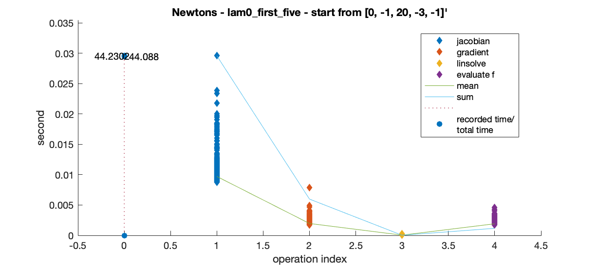

### Numerical Optimization

#### Task 1
Optimize
$$
\lambda = \arg\min\left \{ \int_0^1 e^{\lambda_0+\lambda_1x+\lambda_2x^2+\cdots +\lambda_n x^n}dx-(\lambda_0m_0+\lambda_1m_1+\cdots+\lambda_nx_n)\right\}
$$

##### Newton's Method
```MATLAB
[a_minf, a_lam_, a_errCode, a_itCount, a_fhist, a_xhist] = Newtons(lam0_true_5, [3, 1, 2, 3, -1], 0.0001, 200);

[a_minf, a_lam_, a_errCode, a_itCount, a_fhist, a_xhist] = Newtons([0.5, 0.1], [2, 2], 0.0001, 100);  
trajectory  
```

```MATLAB
[a_minf, a_lam_, a_errCode, a_itCount, a_fhist, a_xhist] = Newtons(lam0_true_5, [0, -1, 20, -3, -1], 0.0001, 1000);
```


Two evidence supporting the derivative rule
- Newtons method uses jacobian and works
- Algebra calculation in bivariable-case matches the partial derivative result

Default 'fminunc'  
```MATLAB
options = optimoptions(@fminunc, 'MaxFunctionEvaluations', 5000);
[x, fval] = fminunc(f, lam0, options)  
```


***

#### Task 2

$$
\frac{d}{d\lambda} \int_0^1 e^{\lambda x^2} dx
$$

$$
\lambda = \argmin_\lambda \Big\{ \int_{x\in \Delta^3} \exp\Big( \sum_{j=0}^d\sum_{i_1}\sum_{i_2}\sum_{i_3} \lambda_{(i_1,i_2,i_3)}x_1^{i_1}x_2^{i_2}x_3^{i_3} \Big) dx - \sum_{j=0}^d\sum_{i_1}\sum_{i_2}\sum_{i_3} \lambda_{(i_1,i_2,i_3)} m_{(i_1,i_2,i_3)}  \Big\}
$$
